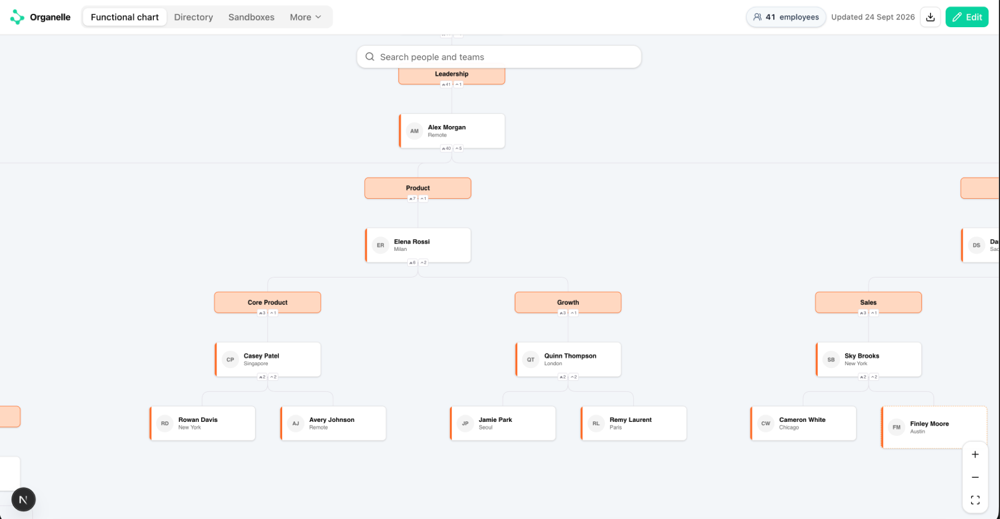
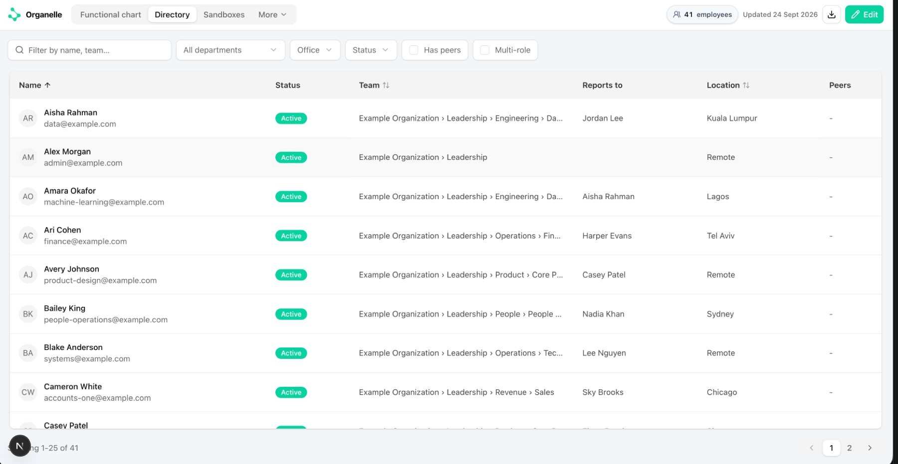
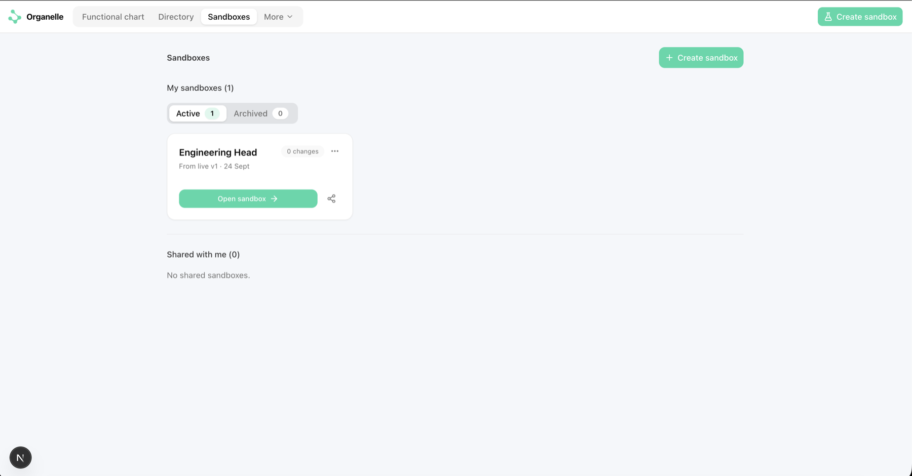
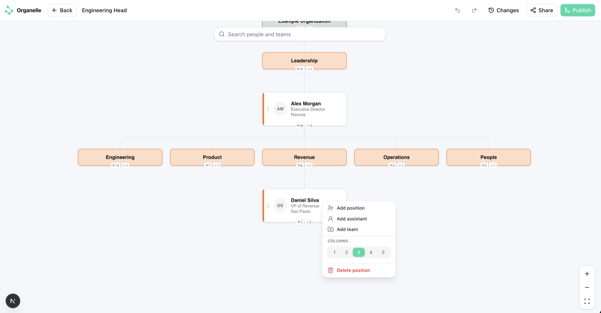
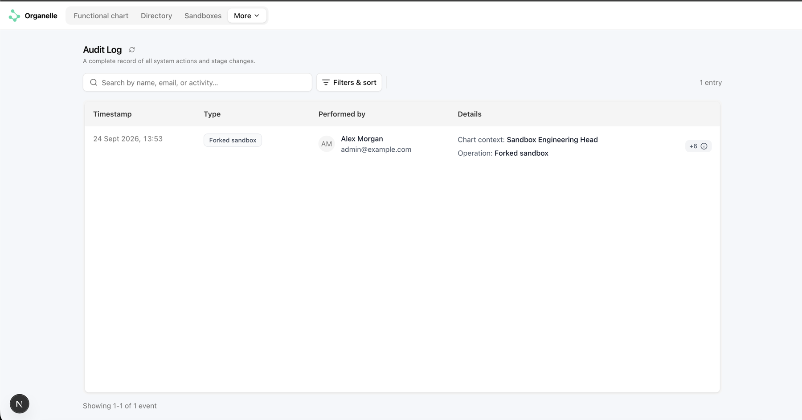
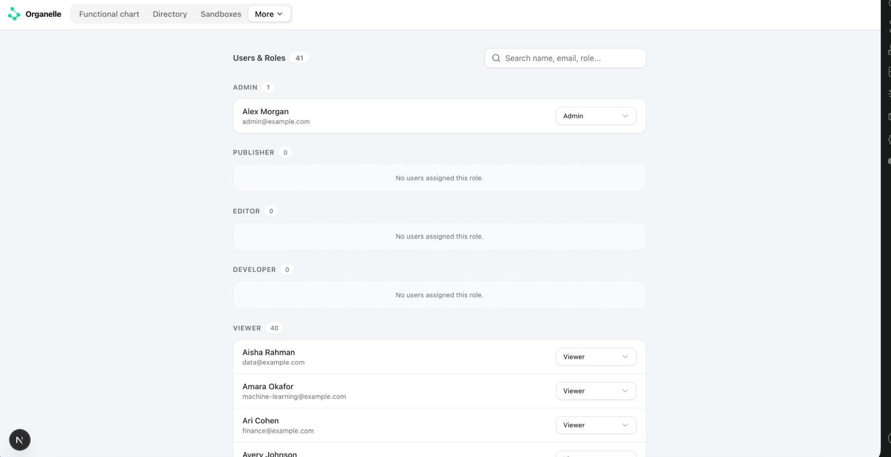

# Organelle

Organelle is a self-hosted organization chart and workforce-directory application. Teams
can browse a published chart, model changes safely in private or shared sandboxes,
review and merge proposals, restore earlier versions, inspect an audit trail, and export
operational reports.

Version 0.1.0 is a public beta. Each deployment represents one organization.

## Features

- Interactive chart and searchable directory
- Sandboxes with sharing, undo/redo, synchronization, and merge review
- Published versions, restore, audit history, seat export, and change reports
- Five built-in roles: Viewer, Developer, Editor, Publisher, and Admin
- Generic OpenID Connect sign-in with encrypted JWT sessions
- Scoped machine API keys for the versioned integration API
- PostgreSQL 17, checked migrations, structured redacted logs, and container-first
  deployment

## Using Organelle

Organelle separates the published organization from proposed changes. Everyone can use
the chart and directory as a shared source of truth, while authorized users model
changes in isolated sandboxes before a publisher makes them live.

The usual workflow is:

1. Explore the published chart or directory.
2. Create a sandbox from the current published version.
3. Edit the structure, invite collaborators, and review the change history.
4. Resolve merge conflicts and publish the sandbox as a new immutable version.
5. Use versions, reports, and the audit log to understand what changed.

### Functional chart

The **Functional chart** is the visual view of the published organization. Search for a
person or team, expand or collapse branches, and use the zoom controls to navigate a
large structure. Person cards show their position and location; team headers group
related positions. The header shows current headcount and the last publication date.

[](docs/images/functional-chart.png)

The published chart is read-only. Select **Edit** to fork it into a sandbox rather than
changing live data directly. Publishers and admins can also download the current seat
export from the chart header.

### Directory

The **Directory** provides a sortable, paginated list of people and their primary
placement. Use the search field and department, office, status, peer, or multi-role
filters to narrow the list. Each row shows status, organization path, manager, location,
and whether the person has peers or more than one assignment.

[](docs/images/directory.png)

Open a person to review their details and assignments. Users with the required role can
update supported directory fields and employment status from the person view.

### Sandboxes

The **Sandboxes** page lists active and archived workspaces you own, followed by
sandboxes shared with you. Select **Create sandbox** to fork the latest published chart,
give the proposal a recognizable name, and open its editing workspace. Archiving keeps
completed or paused work out of the active list without removing its history.

[](docs/images/sandboxes.png)

Inside a sandbox you can:

- Add positions, assistants, and teams from a card's action menu.
- Move parts of the organization, edit people, and adjust leaf-card columns.
- Undo and redo edits, and inspect the sandbox's **Changes** history.
- Share read access with directory users, or edit access with users who already hold an
  Editor-or-higher organization role.
- Synchronize a long-running sandbox with a newer published version.
- Review the final change set and conflicts before publishing.

[](docs/images/sandbox-editing.png)

Editors can create and edit their own sandboxes. Publishers and admins can submit the
reviewed proposal as a new live version. Publishing never rewrites an earlier version.

### Versions and change reports

**Versions** contains the immutable publication history. Open any version to inspect its
chart, compare before-and-after changes, or restore it by publishing its state as a new
version. Use the change report when a structured record of added, moved, changed, or
removed seats is needed.

### Audit log

The **Audit** page records organization and sandbox activity with its timestamp, actor,
operation, context, and detailed metadata. Search the log or filter and sort it by
scope, actor, operation, and date when investigating a change. Audit entries are the
application record of user actions; operational server logs are separate.

[](docs/images/audit-log.png)

### Users, roles, and sandbox access

Admins use **Users & Roles** to search imported directory users and assign one of the
five built-in roles. Viewer is the default when no explicit role is assigned, and the
last remaining admin cannot be demoted. The full capability matrix is documented in
[Authentication and authorization](docs/authentication.md#roles).

[](docs/images/users-and-roles.png)

The separate **Sandbox access** page gives admins an organization-wide view of sandbox
owners and recipients. Sandbox owners normally manage access to their own workspaces
from **Share** inside the sandbox.

### Integrations

Admins use **Integrations** to create scoped API keys and review machine API examples.
Keys expire after 90 days and are shown only when created, so store them in a secret
manager and grant only the scopes the client needs. See the
[Machine API guide](docs/api.md) for authentication, rate limits, endpoints, and
examples.

Navigation is role-aware. Functional chart, Directory, and Sandboxes are the primary
destinations; role-specific areas such as Versions, Audit, Integrations, and Users are
available from **More** when the signed-in user has access.

## Quick start with synthetic data

Requirements: Docker with Compose v2 and Node.js 24 when running CLI commands locally.

If port `5432` is already used by another PostgreSQL instance, choose a free
`POSTGRES_PORT` in `.env` and use that same port in `DATABASE_ADMIN_URL` and
`DATABASE_URL`.

```bash
cp .env.example .env
# Run `openssl rand -base64 32` and paste the result into AUTH_SECRET in .env.
docker compose up -d db migrate
npm ci
npm run db:seed:demo
npm run dev
```

For local-only sign-in, set `AUTH_DEV_EMAIL=admin@example.com` and open
<http://localhost:3000>. The development bypass is rejected by the production container.
Configure an OIDC provider before exposing the service to a network.

To inspect the local PostgreSQL data using a browser, follow the
[pgAdmin development guide](docs/development.md#inspect-the-local-database-with-pgadmin).

To start everything in one step after configuring OIDC:

```bash
docker compose up --build -d
docker compose ps
```

The application port binds to `127.0.0.1` by default. Set `APP_BIND_ADDRESS` only when
you deliberately need another interface and have configured trusted network controls.

### Pre-release database reset

Until the first public release, schema changes are folded into the single baseline.
After pulling a baseline change, recreate the development database. This permanently
deletes all local Organelle data:

```bash
docker compose down -v
docker compose up -d db
npm run db:migrate
npm run db:seed:demo
```

## Bring your own directory

Prepare a CSV with the exact header shown in
[`examples/demo-organization.csv`](examples/demo-organization.csv). Validate it without
writing anything:

```bash
npm run org:import -- --file people.csv --organization-name "Example Organization"
```

Apply only to an empty organization, then nominate the first administrator:

```bash
npm run org:import -- --file people.csv --organization-name "Example Organization" --apply
npm run admin:bootstrap -- --email administrator@example.com
```

The apply operation is transactional. Duplicate identifiers or emails, unknown managers,
cycles, invalid statuses, excessive depth, and malformed values reject the whole import.

Run date-driven employee maintenance at least daily (normally from cron or the host
scheduler). It is a dry run unless `--apply` is supplied:

```bash
npm run employees:reconcile -- --actor-email administrator@example.com
npm run employees:reconcile -- --actor-email administrator@example.com --apply
```

## Documentation

- [Development](docs/development.md)
- [Authentication and authorization](docs/authentication.md)
- [Directory import](docs/importing.md)
- [Architecture](docs/architecture.md), [data model](docs/data-model.md), and
  [database ERD](docs/database-erd.md)
- [Machine API](docs/api.md)
- [Production operations](docs/operations.md)
- [Security policy](SECURITY.md), [support](SUPPORT.md), and
  [contributing](CONTRIBUTING.md)

## Project status

The API and database schema may change before 1.0. Use versioned image tags and take a
tested backup before every upgrade. Images are published as
`ghcr.io/<owner>/organelle:0.1.0` and immutable commit-SHA tags; there is no `latest`
tag before 1.0.

Organelle is licensed under the [Apache License 2.0](LICENSE). Release publication
remains conditional on written confirmation that the project name, icon, and source may
be released under that license.
