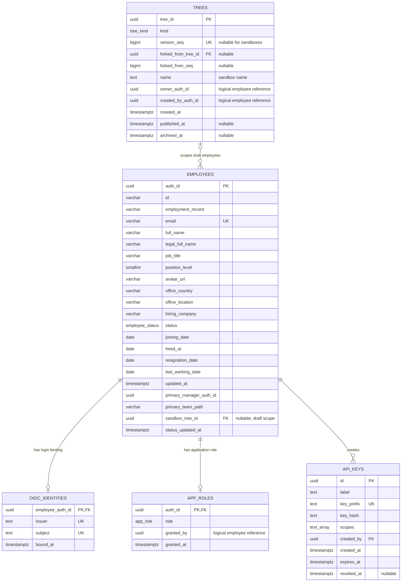
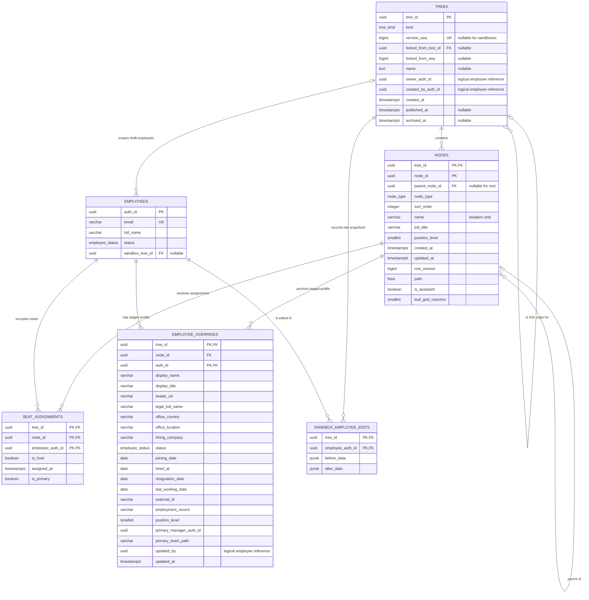
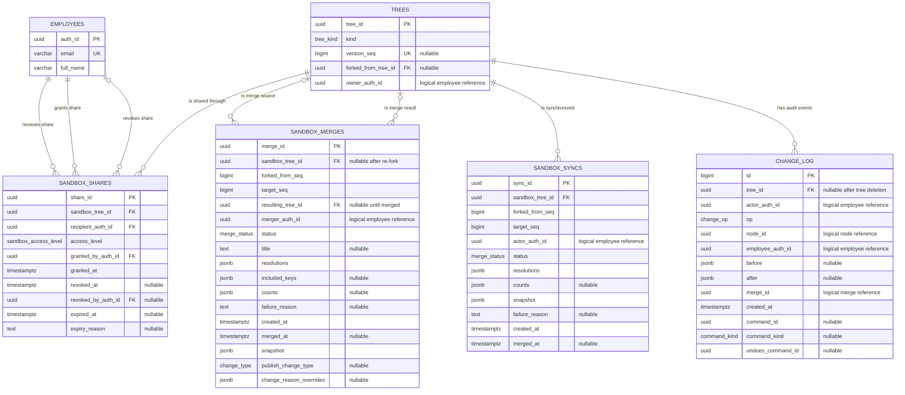

# Database entity-relationship diagrams

Organelle stores application data in the PostgreSQL `organelle` schema. The diagrams
below are views of the same schema, split by domain so that they remain readable on
GitHub and in rendered documentation.

The authoritative schema is
[`db/migrations/0001_baseline.sql`](../db/migrations/0001_baseline.sql). Update these
diagrams whenever that baseline changes. The migration runner's
`public.organelle_schema_migrations` table is operational metadata and is not included
in the application ERDs.

## Legend

- `PK` — primary key; columns can be part of a composite primary key.
- `FK` — declared PostgreSQL foreign key; columns can be part of a composite foreign
  key.
- `UK` — unique key.
- `||` means exactly one, `o|` means zero or one, and `o{` means zero or many.
- A nullable column is marked `nullable` in its comment where that detail is important
  to the relationship.
- JSON fields contain reviewed workflow snapshots or audit payloads; they do not create
  additional database relationships.

## Directory, identity, and access

`employees.auth_id` is the stable internal identity used throughout the application.
OIDC issuer and subject establish the login identity after the first verified-email
binding. Application roles are separate from sandbox-specific access grants.

The unique OIDC key is the pair `(issuer, subject)`, and each employee can have at most
one binding. Employee email is also unique case-insensitively when present; the `UK`
marker is a compact representation of that partial expression index. `key_prefix` is
unique, while only the API-key hash—not the secret—is stored.

## Organization structures and sandbox edits

A tree is one published version, historical version, or sandbox. Node and assignment
keys include `tree_id`, keeping every structure isolated. Employee overrides and edit
snapshots stage profile changes until a reviewed sandbox merge.

Important structural constraints not expressible as simple ERD links include one root
per tree, one host per seat, one primary seat per employee per tree, and one assistant
per parent. `organelle.validate_tree` performs additional whole-tree validation.

## Sandbox collaboration, publication, and audit

Shares grant viewer or editor access to a sandbox. Merge and synchronization records
store the exact reviewed resolutions and snapshot applied by the database functions. The
change log is the append-oriented audit and undo/redo record.

### Logical references

Several actor and audit columns intentionally do not have foreign keys. This preserves
workflow and audit history and avoids coupling every historical event to the lifecycle
of an employee, node, command, or merge row. These include:

- `app_roles.granted_by`
- `trees.owner_auth_id` and `trees.created_by_auth_id`
- `employee_overrides.updated_by`
- `sandbox_merges.merger_auth_id`
- `sandbox_syncs.actor_auth_id`
- `change_log.actor_auth_id`, `node_id`, `employee_auth_id`, `merge_id`, `command_id`,
  and `undoes_command_id`

`employees.primary_manager_auth_id` and `employee_overrides.primary_manager_auth_id` are
also denormalized identity references, not declared foreign keys.

## Deletion behavior

- Deleting a tree preserves its audit entries and sets their `tree_id` to null. It
  cascades to nodes, sandbox edit snapshots, shares, and synchronization records. Nodes
  cascade to seat assignments and employee overrides.
- A node with children cannot be deleted until those children have been moved or deleted
  because the self-referencing parent foreign key uses `ON DELETE RESTRICT`.
- Deleting an employee cascades to its OIDC binding, role, assignments, staged
  overrides, sandbox edit snapshots, and shares received by that employee.
- A merge keeps its provenance when its original sandbox is removed: the
  `sandbox_tree_id` becomes null. Its resulting published tree uses the default
  restrictive behavior.
- A tree referenced as another tree's fork origin cannot be deleted while that reference
  exists.
- Foreign keys without an explicit action use PostgreSQL's default `NO ACTION` behavior.
  In particular, API-key creators and share grant/revoke actors must remain while those
  rows reference them.

## Keeping the ERD current

Before merging a schema change:

1. Update `db/migrations/0001_baseline.sql` (before the first public release) or add the
   appropriate forward migration (after releases begin).
2. Update the affected diagram and relationship notes on this page.
3. Recreate or migrate a test database and run the PostgreSQL-backed test suite.
